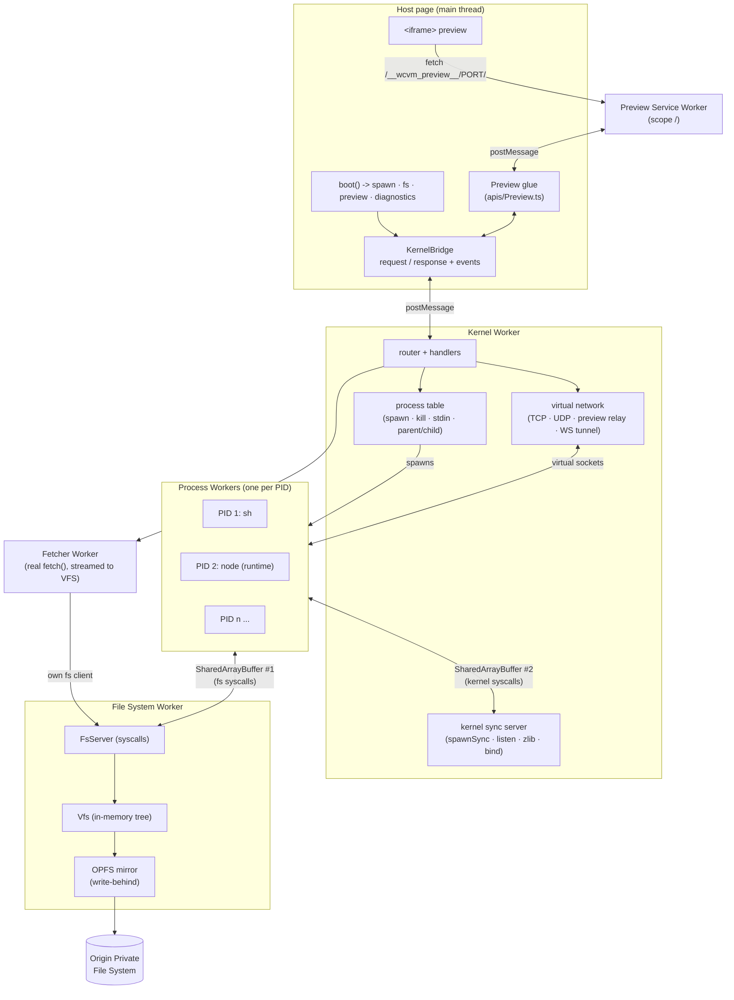
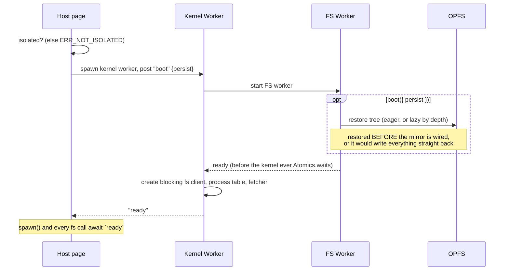
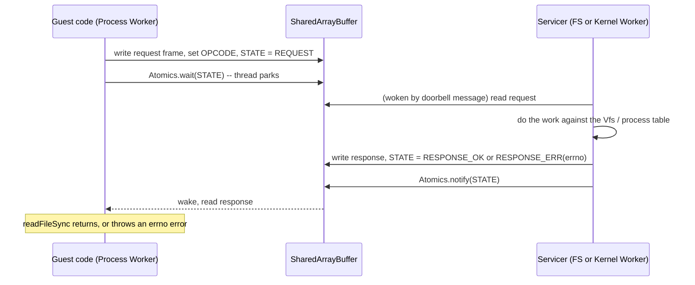
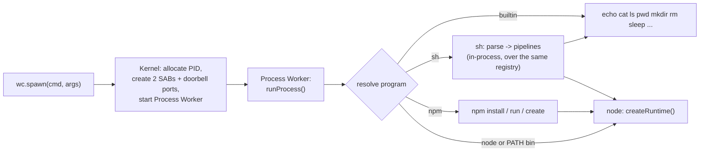
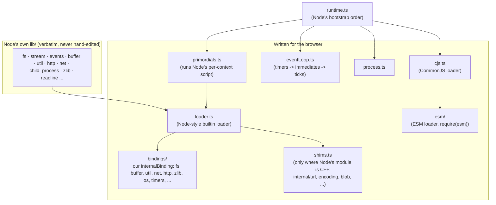
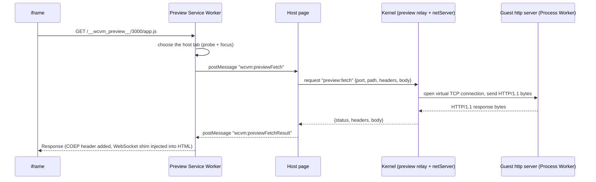
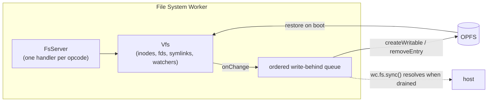
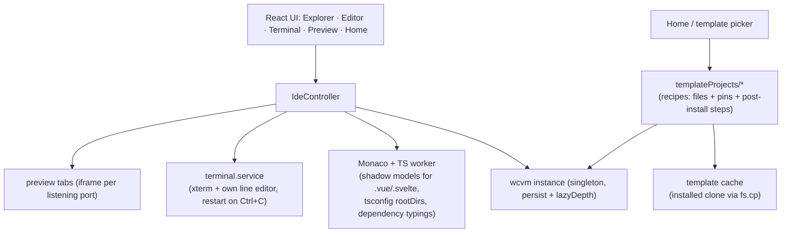

# wcvm architecture

wcvm runs a Node.js project **inside one browser tab**, with no backend. This document explains how: which
threads exist, how they talk to each other, and why it is built this way. For *using* the library read the
[README](README.md); for what is done and what differs from Node read [`PLAN.md`](PLAN.md); for the story behind
each decision and bug read [`HISTORY.md`](HISTORY.md).

> The README's "Architecture" section is generated from this file. After editing it, run
> `node scripts/render-architecture.mjs`: it re-renders the diagrams to `assets/architecture/*.svg` (npm does not render
> Mermaid) and rewrites that section in `README.md` and `packages/core/README.md`.

## 1. The problem and the idea

A browser tab cannot spawn processes, has no synchronous filesystem, and never lets the main thread block. Node
programs expect all three. wcvm's answer:

1. **A process is a Web Worker.** One worker per PID, with its own memory and its own event loop.
2. **A blocked call is `Atomics.wait`.** Guest code calls `readFileSync`; the worker writes a request into a
   `SharedArrayBuffer` and parks. Another worker answers into the same buffer and wakes it. This is the one trick
   everything else rests on (and why the page must be cross-origin isolated).
3. **Node's own JavaScript is the runtime.** Node's `lib/` is vendored unmodified; wcvm supplies only what is native
   in real Node (the `internalBinding` layer, an event loop, a module loader).
4. **The network is virtual.** `net`/`http` talk to other sandbox processes through the kernel; a Service Worker lets an
   `<iframe>` reach a sandbox server.

## 2. System overview



| Thread | Source | Responsibility |
|---|---|---|
| Host page | `src/boot.ts`, `src/apis/`, `src/bridges/` | The public API; turns calls into messages to the kernel and events back into streams. |
| Kernel Worker | `src/workers/kernel/`, `src/kernel/` | Owns the process table, the virtual network, preview relay, the fetcher, and a *blocking* fs client of its own. |
| File System Worker | `src/workers/fs/`, `src/fs/` | The only owner of the `Vfs`; services every filesystem syscall; mirrors to OPFS. |
| Process Worker (per PID) | `src/workers/process/`, `src/programs/`, `src/runtime/` | Runs one program (`echo`, `sh`, `npm`, `node`, ...). `node` hosts the vendored Node runtime. |
| Fetcher Worker | `src/workers/fetcher/` | Real `fetch()` calls (up to ~10 at once), streamed straight into the VFS. |
| Preview Service Worker | `src/workers/preview/` | Intercepts `/__wcvm_preview__/<port>/...` and relays it to a sandbox server. |

## 3. Boot



`boot()` itself is synchronous: it subscribes to `ready` first, then posts `boot`, so the message cannot be missed.

## 4. The synchronous syscall bridge

This is the core mechanism (`src/protocols/syscall.ts`, `src/fs/fsClient.ts`).



One buffer per client, laid out as a 24-byte control block (`STATE`, `OPCODE`, `REQ_LEN`, `RES_LEN`, `SIGNAL`, padding) followed by a
**1 MiB data window**. A request is `[flags][fieldCount]( [len][bytes] )*`; an error response carries the errno string.

Rules that follow from it:

- **Everything must fit the window.** Larger reads/writes are chunked by the client (`fs/fsClient.ts`); an oversize
  request throws `EMSGSIZE`.
- **Each process gets two buffers.** The first goes to the FS Worker (opcodes `OP_READ_FILE` ... `OP_CP`). The second goes
  to the *Kernel Worker* (opcodes `>= 64`: `spawnSync`, `net.listen`, `zlib` sync, `udp.bind`), because process supervision
  lives there.
- **Out-of-band events never use the buffer.** stdout, stderr, exit and incoming network data are `postMessage`s: a
  parked worker cannot receive messages, so the buffer is only for calls the guest is *waiting* on.
- **The kernel must not `Atomics.wait` before its nested workers report ready**, or it deadlocks them.
- `protocols/syscall.ts` must stay dependency-free and use erasable TypeScript only, so it can be imported as-is by Node
  `worker_threads` in tests.

## 5. Processes



- **Streams.** stdout/stderr are `postMessage`d to the kernel and on to the host (or, for a `child_process` child, to the parent's
  worker). stdin is open until closed and is delivered the same way (`writeStdin` / `endStdin`).
- **A shell runs its commands in-process.** `sh`, `npm run` and `node` called from them execute inside the *same* worker. That is
  why there is no `SIGINT`: interrupting one would leave its listeners and globals behind in the shell's worker. Killing a
  process is terminating its worker.
- **`child_process`** starts a real *new* Process Worker, supervised by the kernel through `parentPid`; `fork()` adds an IPC
  channel. **Killing or exiting a process kills its whole subtree**, since a child has no parent left to answer to.
- **Ordering on kill:** terminate the worker *before* detaching its fs client; the fs server closes a client's open fds when
  it is unregistered, and the other order leaks them.
- `worker_threads` run over real `MessageChannel`s; the kernel mints thread ids.

## 6. The Node runtime (`src/runtime/`)



**Path B: vendor, don't reimplement.** `src/runtime/node/lib/**` is generated by `scripts/vendor-node-lib.mjs` from
`node/manifest.json` and pinned by `vendor.lock.json` (sha256 per file, re-checked by a test). Because it *is* Node's code,
behaviour and error messages match Node's; the work is in the bindings, which must return Node's exact values and error
codes. Only a module that is C++ or a C++ parser (`internal/url`, `internal/encoding`, `internal/blob`, ...) is hand-written
(`shims.ts`).

**Module loading.**
- *CommonJS* (`cjs.ts`): `node_modules` and `package.json` `main`/`exports` resolution (including `PATTERN_KEY_COMPARE`), JSON,
  cycles.
- *ESM* (`esm/`): the loader resolves the static import graph itself with Node's algorithm, parses each module with Node's
  vendored acorn, **rewrites specifiers to `blob:` URLs**, and lets the browser's own `import()` link and run them - so live
  bindings, top-level `await` and circular-import semantics are real. A strongly-connected component of the graph (a cycle)
  is merged into getter-based bindings (`esm/cyclic.ts`) because a Blob's content is fixed at creation. `import.meta` is rewritten
  to the module's real `file://` URL.
- *`require(esm)`* (`esm/syncRequire.ts`): like Node 24, an ES module can be `require`d synchronously; it is rewritten into a
  function body over a synchronous import, and top-level `await` raises `ERR_REQUIRE_ASYNC_MODULE`.

**The event loop** (`eventLoop.ts`) models libuv's phases and reference counting: a handle that is ref'd keeps the process
alive, and the loop only exits after microtasks drain and it confirms idleness. Native work (fs callbacks, sockets) re-enters it
through `loop.post()`.

## 7. The virtual network and preview

`net`, `dgram` and `http` are Node's real modules over bindings that route through the kernel (`kernel/netServer.ts`):
`listen()` registers a virtual port, `connect()` creates an in-kernel connection, data flows by `postMessage`. `http` adds a hand-written
HTTP/1.1 wire parser (`runtime/bindings/httpParser.ts`) in place of llhttp. There is no real network: sandbox processes only reach each
other.



Why it is shaped this way:

- **A Service Worker cannot talk to a dedicated Worker**, only to a window client, so it relays through the host page.
- **Which tab?** One Service Worker serves every tab of the origin, and a navigation carries no hint of its embedder. With several
  wcvm pages open the worker asks each (`wcvm:previewProbe`) whether it has a server on that port, then prefers the focused, then
  visible one. This is a heuristic when two tabs listen on the *same* port.
- **Claiming.** A worker claims pages only when it first activates, so `enable()` sends `wcvm:previewClaim` to claim a page that
  loaded uncontrolled (hard reload, "Bypass for network").
- **Absolute paths.** A page at `/__wcvm_preview__/5173/` asking for `/src/main.ts` would escape the prefix. The worker records which
  clients are previewed documents and **redirects** (307) their un-prefixed same-origin requests into the prefix, so each resource has
  exactly one URL.
- **COEP.** The host page is `require-corp`, so an iframe's own response must also declare COEP; the worker adds it to every response.
- **WebSockets** never reach a Service Worker. A small shim injected into each previewed HTML document hands the host a `MessagePort`;
  the kernel's tunnel (`kernel/previewWebSocket.ts`) is a real RFC 6455 client to the guest's `upgrade` handler. This is what makes Vite's
  HMR work.

## 8. Filesystem and persistence



- **One owner.** Only the FS Worker touches the `Vfs`, so there are no locks: syscalls are served one at a time.
- **Watching.** `fs.watch` receives real push events from the `Vfs` (and `watchFile` polls). One logical save reports one change event.
- **Persistence is write-behind.** A syscall answers before its OPFS write finishes. The queue applies changes **strictly in the
  order they happened** (an unordered mirror let a slow first write land after a fast second one). `wc.fs.sync()` is the matching
  completion signal, because write-behind is only safe if callers can ask "are you done".
- **Restore before mirror.** Restoring recreates the tree through `Vfs` mutations; if the mirror were already listening it would write it
  all straight back.
- **Lazy restore** (`lazyDepth`) restores directory structure first and each project subtree the first time a path under it is touched.
- **Symlinks** live in a side manifest, since OPFS has none. Deleting a locked entry is retried briefly.

## 9. Package manager and fetching

`npm install` (`src/programs/npm/`) resolves versions with its own semver, reads packuments from the registry, and downloads tarballs through
`wc.fs.fetch` into the VFS (on the Fetcher Worker, so the bytes never pass through the main thread), then unpacks them. It is deliberately not
real npm: no lockfile, no lifecycle scripts, no workspaces. Real npm was investigated and deferred because its fetch stack has no path to a real
network from inside the virtual `net`.

## 10. Studio (`apps/studio`)

Studio is a client of the public API, not part of the library:



Project templates are *recipes*: the files, the pinned versions that make a framework run here (Vite 7, WebAssembly builds of esbuild/rollup),
and any step a skipped `postinstall` would have done. The first install of a template is cached as a clone inside the VFS, so later projects are
created with one `fs.cp`.

## 11. Invariants and gotchas that shaped the code

| Rule | Why |
|---|---|
| Never edit `runtime/node/lib/**` | It is generated from Node's source and checksum-verified. Fix the binding instead. |
| Test worker/SAB/`eval` changes in real Chromium | Node accepts things browsers reject (e.g. `TextDecoder.decode` on a `SharedArrayBuffer` view). |
| A binding never calls a global (`queueMicrotask`, `setTimeout`) by bare name | `globalObject: self` puts Node's same-named wrappers on the real global; capture the native function at import time or it recurses. |
| Dispatch anything that can reach guest code with `loop.post()` | A synchronous `process.exit()` thrown from a raw platform event escapes the runtime's uncaught-exception handling. |
| `Buffer#slice` returns a view | Copy with `copyBytes` where a copy is meant. |
| Files loaded directly by Node (worker fixtures, scripts) use erasable TypeScript | No enums or parameter properties. |
| When skipping part of Node's bootstrap, re-read the *whole* skipped function | The fd-open call was skipped for `fork()`, and the `ref()`/`unref()` wiring next to it was lost with it. |
| `net.TCP.port` is not "is this the server" | An accepted connection also carries the server's port; use an explicit listening flag. |
| Ref the loop on the operation that *starts* async work | A `connect()` that is not ref'd until it succeeds lets the process exit first. |

## 12. Where to change things

| To... | Do this |
|---|---|
| Add a Node built-in module | Name it in `runtime/node/manifest.json`, run `node scripts/vendor-node-lib.mjs` (or `scripts/discover-node-lib.mjs <id>` to find missing bindings). Implement missing binding members with Node's exact semantics and return codes in `runtime/bindings/`. |
| Add a built-in command | A function in `src/programs/`, registered in `programs/builtins.ts`. Use a getter for any entry that can reference its own registry (`sh`). |
| Add a filesystem syscall | An opcode in `protocols/syscall.ts`, the server handler in `fs/FsServer.ts`, the client call in `fs/fsClient.ts`, and a binding in `runtime/bindings/fs.ts`. Keep the request inside the 1 MiB window. |
| Add a kernel-side syscall | An opcode `>= KERNEL_OPCODE_MIN`, served in `kernel/kernelSyncServer.ts`. |
| Add a framework template | A recipe under `apps/studio/src/services/wcvm/templateProjects/`, verified by an opt-in Playwright case (`WCVM_E2E_VITE=1`). Bump `CACHE_SCHEMA_VERSION` if a cached clone could go stale. |

## 13. Repository map

```
packages/core/            the published `wcvm` library
  src/boot.ts, apis/      public API (boot, spawn, fs, preview)
  src/bridges/            host <-> kernel messaging
  src/kernel/             process table, virtual network, preview relay, sync servers, fetcher host
  src/fs/                 Vfs, FsServer, fsClient, OPFS persistence
  src/protocols/          the syscall ABI, preview and diagnostics protocols (dependency-free)
  src/programs/           echo/cat/.../sh/npm/node
  src/runtime/            the Node runtime (bindings, loaders, event loop, vendored lib)
  src/workers/            entry points: kernel, fs, process, fetcher, preview
apps/studio/              the in-browser IDE built on wcvm
examples/playground/      demo and the Playwright end-to-end suite (real Chromium)
```
